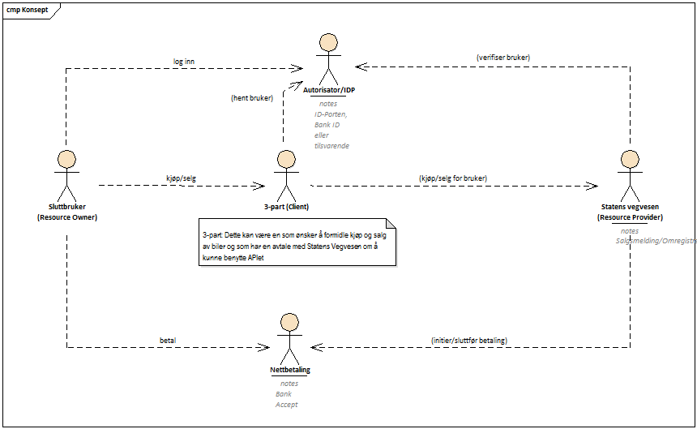

= Arkitekturbeskrivelse
Statens vegvesen - Versjon 0.1

:doctype: book
:docinfo:
:icons: font
:toc: left
:toc-title: Innholdsfortegnelse
:toclevels: 3
:sectlinks:
:numbered:

:leveloffset: +1

Status: Gjeldende +
Publisert: 11.10.2017 +
Lenke til siste versjon: https://www.vegvesen.no/wiki/display/IAOS/02+-+Arkitekturbeskrivelse +

= Introduksjon - løsningskonsept og overordnet beskrivelse

Statens vegvesen har i dag interne systemer for behandling av eierskifte av bil,
herunder betaling av omregistreringsavgift der det er nødvendig. Før det ble
utviklet en selvbetjeningsløsning så ble dette håndtert av ansatte på
trafikkstasjonene. Med selvbetjening ble mange ressurser frigjort, og hvis man
kan utvikle et API som 3-parter kan utvikle applikasjoner mot vil statens
vegvesen kunne frigjøre enda flere ressurser. Dette vil også være i i tråd med
statens ønske om mer digitalisering.

Siden API-et vil måtte håndtere personopplysninger - personnummer knyttet til
bil - er det viktig at løsningen er sikker og at man kan være sikker på at data
som utveksles for en person faktisk er personen som ønsker å selge/kjøpe bilen.
Dette vil sette krav til 3-part og det må utvikles avtale mellom statens
veivesen og 3-part. Denne arkitekturbeskrivelsen vil ikke gå inn i dette.

Bildet over skisserer hvilke parter som vil være involvert i bruken av API. Det som beskrives her er

* Forhold som 3-parten må tenkte på. Hvordan autentiseringen av brukeren skal
  gjøres, hvilke informasjon som må sendes ved i hvert API-kall osv.

* Forhold som vegvesen.no må tenkte på. Strukturen på API - prosessen til
  salgsmelding og omregistrering. Verifisering av hvert enkelt anrop. Hvordan
  det passer i SVV sin infrastruktur.

* Håndtering av betaling i forbindelse med betaling av omregistreringsavgift.

Legg merke til at slukkbruker i denne sammenheng kan være en som ønsker å selge
bilen sin på finn.no, eller det kan være en ansatt i et leasingselskap som
ønsker å selge/kjøpe biler som selskapet eier. I Første tilfelle er 3-part
finn.no, i andre er det leasingsselskapet.

= Funksjonelle mål og krav

== Overordnet mål med leveransen (målformulering)

Målet for prosjektet er å utrede og beskrive de områdene som er nødvendig for at
utvikling av tredjeparts APIer kan startes i etterkant og at APIer (når de er
utviklet) kan tas i bruk av tredjepart. Det innebærer nødvendige retningslinjer,
standarder og avtaler. Prosjektet definerer selv hvilke retningslinjer,
standarder og avtaler som er nødvendig for å nå målene, men de skal som minimum
dekke arkitektur, sikkerhet, tilgjengelighet, brukskvalitet og juridiske
aspekter samt profilering og gjenkjennelighet. I den grad prosjektets leveranser
påvirker eksisterende retningslinjer og standarder, bør disse oppdateres.
Oppdragsgiver skal etter prosjektet ha trygghet for at tredjeparts APIer kan
utvikles uten at det utfordrer arkitektur, sikkerhet, ansvarsforhold eller
eksisterende interne retningslinjer.

Juridisk må roller og ansvar avklares - hvem som har ansvar for hva i en
integrert løsning, og hvordan dette skal reguleres. Skal man ha en generell
bruksavtale eller skal det signeres konkrete avtaler med hver enkelt
brukerorganisasjon/tredjepart? Skal det være krav om at det synliggjøres for
sluttbrukeren av de integrerte tjenestene hvem som har ansvar for de enkelte
delene av den? Skal tredjepart i noen sammenheng kunne opptre på vegne av
sluttbruker, eller skal det åpnes for fullmaktsløsninger?

Når det gjelder profilering og gjenkjennelighet så må det vurderes om
sluttbruker skal måtte forstå at Statens vegvesen har ansvar for enkelte deler
av prosessen og i så fall, hvordan dette skal gjøres og hvordan det skal se ut.
Disse kravene må i så fall gjenspeiles i bruksavtalene med tredjepart. Det er en
del av prosjektet å utrede behov for endringer i lov eller forskrift, men i
første omgang tas det ikke høyde for endringer i roller og ansvar eller
implementering av fullmaktsløsninger. Dersom det på et seinere stadium er
aktuelt å overføre ansvar til tredjepart eller lage fullmaktsløsninger, må slike
forhold utredes.

Det må beskrives en funksjonell arkitektur som ivaretar sikkerhet både for
brukerne av APIene, brukerne av de integrerte løsningene og for system,- og
dataeiere i Statens vegvesen. Det kan også være behov for å se på kostnader
vedrørende teknisk tilrettelegging, teknisk støtte og oppetider for tjenestene.
Med teknisk tilrettelegging menes tiltak og investeringer som er nødvendig for å
kunne levere tredjeparts APIer. Teknisk støtte er den støtte som tredjepart
måtte ha behov for i implementering og drift av sine løsninger. Det må videre
vurderes om innføring av tredjeparts APIer medfører endrede oppetidskrav.
Prosjektet skal legge til rette for utvikling av tredjeparts APIer som
samarbeidspartnere finner nyttige og egnet for sin bruk.

De reelle gevinstene fra dette prosjektet nås gjennom at tredjeparts APIer kan
utvikles, at disse kan tas i bruk av eksterne samarbeidsparter og at brukerne
benytter seg av tjenestene/selv­betjenings­løsningene.

=== Effektmål

Når prosjektet er ferdig skal systemeiere på TK-avdelingen kunne starte
prosjekter for utvikling av tredjeparts APIer uten å møte arkitekturmessige,
sikkerhetsmessige, brukbarhetsmessige eller juridiske hindringer. Prosjektets
resultater skal bidra til at tredjeparter skal kunne integrere Statens vegvesens
tjenester i sine løsninger. Det skal gi brukerne bedre løsninger og at brukerne
i større grad foretrekker digitale løsninger framfor oppmøte.

== Resultatmål

Det skal leveres retningslinjer og standarder som er nødvendig for å utvikle og
ta i bruk tredjeparts APIer. Som minimum skal retningslinjene og standardene
dekke arkitektur, sikkerhet, tilgjengelighet, brukbarhet og juridiske aspekter
samt profilering og gjenkjennelighet.

Arbeidet skal avsluttes høst 2017.

= Etatens arkitekturprinsipper for IKT-løsninger

[cols="2,9a,9",options="header",grid="cols"]
|==================================
Arkitekturprinsipp | Kort beskrivelse | Hvordan vil leveransen understøtter disse prinsippene?

|Fremtidsrettet
|
IKT-løsningene dekker Statens vegvesens fremtidige behov og er i tråd med
etatens mål og planer for bruk av IKT. Vurderinger og prioriteringer av
IKT-løsninger tar hensyn til et gevinst- og kostnadsbilde for hele livsløpet til
IKT-løsningene.
|
I henhold til digitaliseringsrundskrivet er det mål at man skal gjøre offentlig
informasjon tilgjengelig for viderebruk - også gjennom API-er.
Å få parter utenfor vegvesenet til å lage løsninger som kan avlaste prosesser
internt er nyttig.

-----------------------------------

|Tilgjengelig
|
IKT-løsningene er lett tilgjengelig for sluttbrukerne når de trenger dem.
|
Å lage API-er som er tilgjengelig døgnet rundt vil gi parter mulighet til å lage
tilgjengelige løsninger.

Dette vil i andre omgang gjøre våre tjenester mere tilgjengelig for sluttbrukere.

|Brukervennlig
|
IKT-løsninger er tilpasset sluttbrukerne og deres bruksmønstre.
|
N/A

|Prosesstilpasset
|
IKT-løsninger er tilpasset arbeidsprosessene til Statens vegvesen på en effektiv
måte som sikrer god kvalitet på resultatene.
|
API-et skal muliggjøre at brukerne selv kan gjennomføre eierskifte og
omregistrering. Dette er eksisterende prosesser som løses enten gjennom
selvbetjening hos SVV eller som en del av fagsystemet (autosys). Må regne med at
det er behov for teknisk brukerstøtte i tillegg til funksjonell brukerstøtte
slik man har i selvbetjeningsløsningene.

|Samhandlende
|
IKT-løsningene skal på en enkel måte kunne virke sammen (samhandle) med andre
IKT-løsninger, både innenfor og utenfor etaten.
|
API-et bygges på eksisterende selvbetjeningsløsninger og vil ikke samhandle som
sådan med andre IKT-løsninger - det vil ikke være datautveksling for eksempel.

|Gjenbrukbar
|
Gjenbruk prioriteres både i forhold til å:

* velge allerede gjenbrukbar funksjonalitet og data

* investere i gjenbrukbarhet ved etablering av nye IKT-løsninger

|
Løsningen vil benytte seg av eksisterende selvbetjeningsløsninger. Vi vil også
basere oss på eksisterende API-er.

Man ønsker å lage standarder og retningslinjer som kan beyttes i fremtidige API-er.

|Sikker
|
IKT-løsningene og informasjonen er sikret mot brudd på konfidensialitet,
integritet og tilgjengelighet.
|
Et viktig kriteria er at API-et er sikret mot brudd på konfidensialitet,
integritet og tilgjengelighet. Konfidensialitet betyr at man kan være sikker på
at de som foretar eierskifte faktisk er de som er med i salgsmeldingen og at
ingen andre får innsyn i denne.

|Åpen
|
IKT-løsningenes datagrunnlag, virkemåte og anvendelse kan gjøres rede for.
|
IKT-løsningenes datagrunnlag, virkemåte og anvendelse kan gjøres rede for.

|Fleksibel
|
IKT-løsningene er bygget med tanke på mulige endringer i:

* anvendelse
* arkitektur
* infrastruktur
* forvaltning og drift

IKT-løsninger er utformet slik at det er tids- og kostnadseffektivt å foreta endringer.
|
API-et som utvikles skal kunne brukes av ulike 3-parter. Skal være så generisk som
mulig som kan sikre at de fleste tjenesteutviklere skal kunne ta del i dette.
|==================================

= IKT-krav for løsning

IKT-kravene er beskrevet i link:img/IKT-krav-til-losning.xlsx[eget excel ark]. Disse gjelder for utvikling av API-et. I tillegg har vi her behov for å definere endel krav som går på bruk av API-et.

[cols="2,9,9",options="header",grid="cols"]
|==================================
| Egenskap | Beskrivelse | Krav
| Tilgjengelighet |
Tjenesten skal være tilgjengelig. Planlagt nedetid skal det informeres om i god tid i forkant.
| 99.9%
|==================================

== Autentisering av sluttbrukere

Hvis man ser på figur 1 så må sluttbrukeren autentisere seg mot en "identity
provider" (IDP). Dette må være en av IDP-ene som statens vegvesen godkjenner,
f.eks. id-porten/difi eller bank-id. Prosessen med å få autentisert brukerene
starter hos 3-part når bruker ønsker å benytte seg av en tenkt eiersiftetjeneste
hos 3-part. Denne prosessen er i henhold til OpenId Connect stadarden som
beskriver flyten mellom sluttbruker - klient (3-part) - autorisasjonsserver
(idp) og resource provider (SVV). Etter at bruker er autentisert vil 3-part
sitte igjen med et aksess token som skal benyttes i alle kall mot statens
vegvesen. Dette aksess token må tjenestene som implementerer API-et forholde seg
til.

Statens vegvesen er i ferd med å etablere en "secure token service" (STS) som
vil konvertere f.eks. aksess token til interne token i vegvesenet (svv token)
som i fremtiden kan benyttes for kall mot baksystemene. Her så vil man kun
benytte STS for å få tilgang til personopplysninger om brukeren. Svv token vil
være et standard JWT token og API-et skal slippe å validere dette men trenger
kun å hente ut personopplysninger som f.eks. fødselsnummer.

[cols="2,10",options="header",grid="cols"]
|======================
|Rolle	|Krav til rolle

|IDP	|Identifisere brukere med 2-faktor autentisering

|IDP	|Støtte Open ID Connect/Oauth2

|IDP	|Utstede sikkerhetstoken til SVV som inneholder brukerdata, som fødselsnummer, uten at 3-part får tilgang

|3-part	|Sørge for at aksess mot SVV skjer kun på vegne av brukere som er autentisert av IDP

|3-part	|Støtte Open ID Connect/Oauth2.

|3-part	|Alle aksess mot SVV skal inneholde et gyldig aksess token, som skal kunne benyttes av SVV for å hente ut personopplysninger

|SVV	|Implementere en STS, som sørger for konvertering av aksesstoken til svv-token på en effektiv måte.

|SVV	|Tilby API som krever en avtale mellom SVV og 3-part.  3-part får utlevert en API-nøkkel

|SVV	|Ha avtaler med IDP om bruk av deres tjenester
|======================

== Autorisasjon

SVV vil måtte ingå kontrakt med 3-part når disse ønsker å ta i bruk API-et.
Kontrakt vil innebære at det utstedes en API-nøkkel (navn/passord) som SVV vil
verifisere ved hvert anrop. Dette vil verifiseres ved standard filtrering i
skallsikring (nøkkel er identifikator i "basic auth" headeren på anropet).

I selvbetjening i dag har vi funksjonalitet for at sluttbrukere kan operere på
vegne av en organisasjon, hvor tilgang er blit deligert i Altinn. Tanken er at
samme mekanisme skal gjelde i API-et.

På sikt kan man tenke seg mer avanserte fullmaktsløsningen som f.eks. at bruker
gir 3-part fullmakt til å gjennomføre eierskifte og omregistrering. Altinn har
en løsning for dette men vi vil ikke ta opp bruken av denne her.

[cols="2,10",options="header",grid="cols"]
|=========
|Rolle	|Krav
|SVV	|Tillate at brukere som har fått tildelt rolle i Altinn kan operere på vegne av en bedrift.  Dette gjøres ved å benytte IKT-løsningen Altinn-Oppslag
|SVV	|
|=========