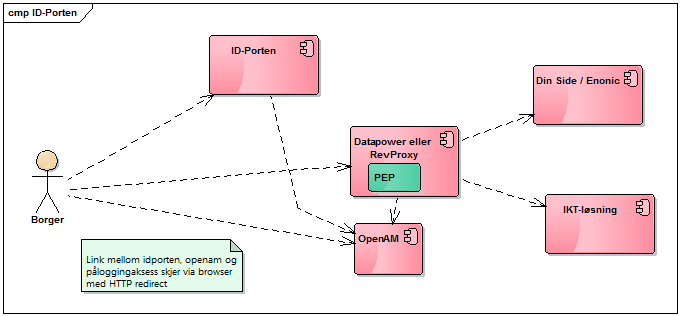
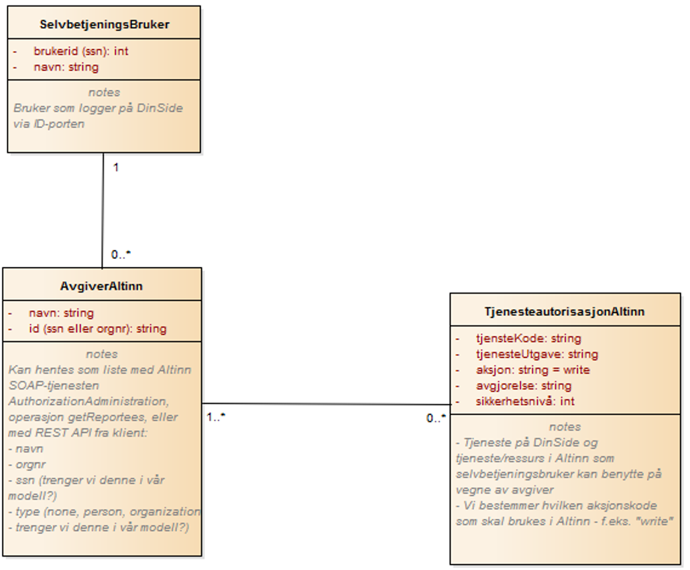

= Retningslinjer for utvikling av selvbetjeningsløsninger i SVV
v1.0,
include::../locale/attributes-nb.adoc[]
:toc:

// asciidoc -b html5 -a icons -a toc2 -a theme=flask  index.adoc

:numbered:
[bibliography]
== Innledning

Utviklingen av selvbetjeningsløsninger (eller publikumstjenester) følger de samme generelle
retningslinjene som annen utvikling i SVV [5]. Dette dokumentet tar for seg ikt-løsninger
hvor brukerne finnes utenfor SVV - publikum eller borgere - og kan logge seg på "din side" og få
utført tjenester for seg selv eller en bedrift, som i dag utføres av ansatte i vegvesenet
(på en trafikkstasjon). Eksempler er tjenester som omhandler egne kjøretøy, førerkort,
søknader om avkjøring osv.

Dokumentet skal brukes på samme måte som det generelle retningslinjene blir brukt og av den
samme målgruppen. Legg også merke til at når vi skriver IKT-løsninger eller applikasjoner i dette
dokumentet så er det selvbetjente løsninger vi skriver om.

De selvbetjente løsningene understøttes oftest av eksisterende fagsystemer. Målet er å la brukeren
overta prosesser i disse systemene som i dag utføres av ansatte. Eksempler kan for eksempel være
innsyn i egne førerettigheter (førerkort), foreta eierskifte av bil (salgsmelding) og omregistrering.
Samtidig utvikles det nye publikumsystemer som står mer på egne ben, eksempelvis personlig kjennemerke.
footnote:[IKT løsningen har integrasjoner mot andre fagsystemer, som motorvognregisteret og arkivet.]

== Enonic som tjenesteplattform

SVV benytter Enonic CMS som plattform for publisering på Internett og Intranett.  Den versjonen som
vi benytter er noen år og det er tenkt å erstatte denne med en ny eventuelt annet produkt.  Enn så
lenge så vil vi måtte forholde oss til hvordan man publiserer innhold og tjenester.

Publisering kan kort sies å foregår ved at man programmerer "portlets" som inngår i en "side mal".
Hver portlet inneholder en datakilde og ett transformasjonsskript som oversetter data til html. Data
representeres iform av xml strukturer.

Vanlig publisering foregår ved at brukerne har et grensesnitt for å legge inn data inn i enonics
database.  Dataene vil legges inn som xml strukturer og vil hentes frem når de vises for brukerne på
internett - på måten beskrevet over.

Datakilden i Enonic kan også være programmerte tjenester som produserer xml strukturer og som igjen
transformeres av Enonic xml/xsl motoren.  Dette ønsker vi å komme bort fra.

For tjenester som må programmeres så vil vi at disse skilles ut fra Enonic.  Enonic benyttes bare
for å produsere selve sidemalen - hode og hale på siden - og så er tjenesten fri til å presentere
innholdet i en del av siden som blir tildelt.

Ledetekster og andre tekster som ikke endres ofte administreres i Enonic og så kan tjenestene hente
ut disse ved at det fins en "portlet" i enonic som produserer en json struktur som en html/javascript
klient kan utnytte.

Når det gjelder rammeverk for klientutvikling så er koden på "din side" programmert i Angular,
versjon 1.0.  Dessverre er ikke denne kompatibel med nyere versjoner, og andre prosjekter i SVV har
valgt React.

=== Din side

Som nevnt over så ønsker vi at alle tjenester på vegvesen.no løsrives fra Enonic og at det
kun benyttes som et repository for å lagre unna javascript og stiler.  Disse legges opp på et
statisk område, og deploy av disse filene betyr at det pakkes en javascript fil for hver
tjeneste som inneholder også html for presentasjon.

Javascript klienten vil etter å ha blitt lastet inn i nettleseren presentere innholdet og all
kommunikasjon mot vegvesen.no vil være tjenestekall (REST/JSON).

image::img/image2017-1-21_10-17-27.png[]

De ikt-løsningene som krever at bruker skal autentiseres skal ligge under menyinnslaget
"/dinside/*".   Adressen vil medføre at skallsikringen foretar den nødvendige sjekken og om
nødvendig sender brukeren til Id-porten for autentisering.

== Sikkerhet

Alle IKT-løsninger skal gjennomgå en verdivurdering, som inkluderer en risiko og
sårbarhetsanalyse.  Ut fra dette lager man tiltak for å øke sikkerheten.

Gitt at man har 4 nivåer på sikkerhetsbehovet så må hver enkelt ikt-løsning finne ut hvilke
sikkerhetsmekanismer som skal settes inn. Det er forskjell på tjenester som opererer på
upersonlige åpne data og de som behandler personsensitive data.

Hvis man skal lage en selvbetjent ikt-løsning som baserer seg på at brukeren skal får tilgang
til sine egne personsensitive data så må følgende tiltak gjøres:

* ikt-løsningen skal ligge i sikkerhetssone 4

* ikt-løsningen skal bare gi tilgang til brukere som er logget inn på sikkerhetsnivå 4.
ID-porten har flere valg for autentisering, f.eks. bank-id og min id.  De fleste er på nivå 4
men ikke min id.

* ikt-løsningen må spesifisere hvilke sensitive data som behandles og sørge for at disse ikke
logges i hverken hendelseslogg (se under) eller feillogg.

* Gjennomføre penetrasjonstest etter at man har gått gjennom og vurdert ikt-løsningen i
relasjon til OWASP Top-10<<13>>.

=== Autentisering

Bruk av ID-Porten gir 2-faktor autentisering og skal brukes for autentisering av
brukere.  ID Porten forutsetter at brukere har såkalt elektronisk ID, hvor brukere
kan velge blant 5 typer (MinID, BanID, osv).  Foruten MinID, som er på mellomhøyt
sikkerhetsnivå, er de andre 4 på høyt sikkerhetsnivå.

Alle som skal logge seg på med ID-Porten må være registrert som brukere, hvor
identen er fødselsnummeret, eller et D-nummer. Når du registrerer deg kan du i
tillegg registrere telefon og epost (eller begge deler).  Alle disse dataene vil
ligge i et felles "kontaktregister". Autorisasjonen foregår ved at brukeren velger
en av de 5 leverandørene for elektronisk id.  ID-Porten vil så federere brukerdata
mot SVV og OpenAM <<1>><<2>>. Disse vil legges inn et eget SVV LDAP regime.  Brukerne
vil ligge der en spesifisert tidsperiode (session timout på 120 minutter).

NB! IKT-løsningen må sikres med brannmurer for aksess fra interne brukere.
Uten dette vil det være enkelt å legge på riktige http-header for å skape seg
tilgang til ikt-løsningene.

=== Autorisasjon

Brukerne kan ivareta ulike roller i vegvesenets IKT-løsninger.  Det mest vanlige
er at de opererer på vegne av seg selv og løsningen tilbyr funksjoner og data for
å få tilgang til å endre data om seg selv.  I andre sammenhenger kan det være at
brukeren i kraft av å ibeha en rolle får tilgang til data som omfatter denne
rollen, f.eks. en daglig leder i en bedrift skal ha muligheten å omregistrere
bedriftens biler.

Det er utviklet en komponent i SVV (Altinn Oppslag <<3>>) som IKT-løsninger skal
bruke for:

* At selvbetjeningsbrukere skal kunne velge om han/hun skal operere på vegne av
seg selv eller på vegne av en annen «avgiver», dvs. organisasjon/bedrift eller
person

* Selvbetjeningsbruker skal få presentert de SVV-tjenester han/hun har fått
rettighet til og skal kunne velge tjeneste

* Selvbetjeningsløsning skal kunne verifisere at bruker har rettighet til
SVV-tjenesten som velges.

Forutsetninger for bruk av komponenten:

* SVV-tjenestene skal meldes inn i Altinn som «delegerbare lenketjenester»:
- SVV-tjenester vi skal hente rettighet/autorisasjon til i Altinn må være
registrert i Altinn selv om tjenestene ikke har Altinn-skjema
- SVV-tjenestene i Altinn, f.eks. Salgsmelding for kjøretøy, registreres som
lenketjeneste
- SVV-tjenestene som en sluttbruker (innlogget via ID-porten) skal bruke på
vegne av en annen avgiver (person eller organisasjon) må være delegerbare.

* DinSide og selvbetjeningsløsningene må kjenne altinnkode og altinnutgave
for de aktuelle SVV-tjenestene

* Tilgangsstyringen til SVV-tjenester i Altinn skal administreres i Altinn av
avgivere (virksomhetene)

=== Konfidensialitet, integritet og tilgjengelighet

For de ikt-løsningene som behandler sensitive data er de viktig at dette
ikke lagres eller caches noe sted.  I demme tilfellet skal data kun "rutes"
gjennom ikt-løsningen.  For øvrig refereres det til sikkerhetsmodell for
applikasjoner <<4>>.

== Løsningsarkitektur

Alle IKT-løsninger skal følge arkitekturprinsippene som bl.a. er beskrevet i
retningslinjene for utvikling.  I tillegg er det utarbeidet IKT-krav som
løsningene skal oppfylle. Arbeidet med løsningsarkitektur må derfor holde
seg innenfor disse rammene som IKT kravene, eller kvalitetskravene, setter.
Sikkerhet, tilgjengelighet, ytelse, modifiserbarhet osv. er svært viktig for
å komme frem til også gode selvbetjeningtjenester.

Vanligvis vil disse typene av tjenester ta utgangspunkt i allerede etablerte
fagsystemer. Dermed vil det finnes flere typer brukere av de samme dataene.
Selvbetjeningstjenestene vil da utgangspunkt i fragmenter av data og funksjoner
fra den helhetlige ikt-løsningen som igjen brukes av fagpersoner ansatt i
vegvesenet.  I andre tilfeller hvor det er nyutvikling kan selvsagt
selvbetjeningsfunksjonalitet og fagsystem utvikles og i parallell, og i
atter andre er hovedpoenget at selvbetjeningsbrukerne selv skal være
primærbrukeren.

Vi kan dermed si at vi vil ha 3 typer av brukere i alle ikt-løsninger

* eksterne.  Dette er det vi definerer som selvbetjeningsbrukerne.
* interne.  Dette kan være ansatte som har spesialrolle for selbvetjeningsløsningene
* fag-brukere.  Detter er ansatte som bruker fag-løsningene

=== Lagdelt arkitektur

Retningslinjene for IKT utvikling i statens vegvesen definerer en lagdelt
modell for IKT-løsninger<<5>>.  Selvbetjeningsløsningene utvikles ved at
grensesnittet (GUI Presentasjonlag) består av et sett med HTML/CSS/Javascript
filer som legges ut på Enonic. Når brukeren går inn på en tjeneste, f.eks.
omregistrering så er det disse filene som aksesseres fra nettleseren.  Resten
av tjenesten aksesseres som REST tjenestekall mot ett eller flere såkalte
daptere.  Disse tilpasser data fra bakenforliggende kall til nettleseren
via et sett med REST tjenester.

===  Tjenester: Eksponering, autentisering og autorisasjon

Når man utvikler komponenter i selvbetjeningsløsningen så vil disse konsumeres av
ulike brukergrupper (se bilde under):

* eksterne brukere som er autentisert via ID-porten.  Disse slipper gjennom
skallsikringen og ytre endepunkt mappes til indre endepunkt.

* interne brukere som ikke er autentisert via ID-porten men via etatens SSO-løsning.
Også her vil ytre endepunkt mappes til indre - samme som for eksterne brukere.

* tjenestebrukere som heller ikke er autentisert via id-porten, men er satt opp internt
i SVV sin LDAP løsning.

Grunnen til at man har opp mot 3 eksterne endepunkter som mappes til samme interne
endepunkt er at skallsikringen skal kunne kjenne igjen endepunktet og foreta sjekk av
bruker og legge på riktig USER_ID i request header.

****
Ekstern eksponert:
*pass:quotes[https://www.vegvesen.no/ws/no/vegvesen/.../tjeneste_federertbruker]*

Mappes til intern *pass:quotes[https://www.vegvesen.no/ws/no/vegvesen/.../tjeneste]*

Tilsvarende for interne brukere og andre interne tjenester
****

Selve tjenesten (selvbejeningsadapter i figuren) vil dermed finne bruker sin
id i USER_ID feltet - og vil på denne måte kunne bestemme hvilke type bruker det er.

Eventuell fingranulert autorisasjon i tjenesten må implementeres.

=== Gjenbruk

Det er utviklet en rekke fellestjenester <<7>> som selvbetjeningsløsningene bør
benytte der det er hensiktsmessig. Vi vil i dette avsnittet trekke frem noen som
er spesielt viktig.  Tjenestekall til disse fellesløsningene skal benytte eksponert
endepunkt i skallsikringen.

==== Nettbetaling

For de selvbetjeningsløsninger som trenger funksjonalitet for nettbetaling <<6>>
så finnes det en egen tjeneste for dette.  For at tjenesten skal kunne brukes må
det finnes en mottaker av betalingen (brukersted).  Per idag er det registrert 3
enheter i Skatteetaten og 1 i vegvesenet.   Skal man inkludere flere må dette tas
opp med Nettbetaling.  Tjenesten har i dag et api bestående av følgende funksjoner:

* Opprett betaling.  Skal inneholde felter som KID (referansenummer), redirectUrl
(hvor man skal sendes etter at betaling er gjennomført), kjøper (kundeID), beløp,
målform og brukersted (mottaker).  Returnerer en betalingsId.  Denne vil bare
registrere betalingen hos NetAxept og vil vente på "Hent betaling".

* Hent betaling.  Skal inneholde id fra "Opprett Betaling".  Denne vil lede
brukeren til NetAxept som vil sette opp et eget grensesnitt for selve betalingen.
Når betalingen er gjennomført vil NextAxept sende brukeren til siden som ligger
bak "redirectUrl".  Her vil man fullføre betalingen, "Fullfør Betaling"

* Fullfør Betaling.  Skal inneholde id fra "Opprett Betaling".  Vil godkjenne
betalingen overfor NetAxept og sende kvittering til brukeren.

==== Brukerdata og "Kunde"

Etter at bruker er autentisert av skallsikring (via id-porten) vil requesten rutes
til den aktuelle tjeneste hvor fødselsnummer er lagt inn i request header (User_Id
eller SNN.footnote:[Datapower legger fødselsnummeret inn i user_id og reverse proxy
benytter ssn for samme felt]).  For mange av tjenestene/fagsystemene så benyttes ikke
fødselsnummer som identifikator - spesielt for mange "TK" applikasjoner benyttes
kunde_id som unik identifikator.  Denne kunde_id administreres av en egen tjeneste,
Kunde, som tilbyr et kunderegister med offisielle person- og organisasjonsopplysninger
hentet fra hhv. Det Sentrale Folkeregisteret (DSF) og Enhetsregisteret. Data hentes
og oppdateres online og ved daglige vaskerutiner.
I Kunde kan man mappe mellom fødselsnummer og kunde_id.

Selvbetjening har utviklet et rest/json adapter mot Kunde som gjør det enklere for javascript
applikasjoner å benytte Kunde.  Dette vil snart lanseres som en tjeneste i ikt-løsningen
SB Felles.

For å kunne nå fagsystemer som opererer med kunde_id som identifikator er man nødt til
å slå opp i svv kunde for å hente ut denne.  I tillegg om man behøver navn og adresse om
brukeren så vil man finne det her.

Tilstanden til den innloggede bruker vil bevares ved at det skapes en cookie under
autentisering.  Alle etterfølgende request så vil skallsikringen utnytte dette ved å legge på
fødselsnummer.  Selvbetjeningstjenestene kan nyttiggjøre seg dette.  I tillegg vil tjenestene
kunne nyttiggjøre seg det at når brukeren velger å representere en organisasjon på din side så
vil denne tilstanden spares i "klienten" og request fra denne vil inneholde attributtet AGIVERID
som er organisasjonsnummeret.

==== Hendelseslogg

Mange av selvbetjeningsløsningene vil fungere som et tillegg til etatens
fagsystemer.  De vil derfor ikke ha behov for å lagre egne data om operasjoner
som brukeren gjøre, fagsystemet vil ha full oversikt over brukerens operasjoner.
Det kan imidlertid være unntak fra dette, f.eks. ved introduksjon av nettbetaling
hvor selvbetjeningen vil koble fagsystemet, mot betaling og kanskje også
registrering i økonomisystemet.  TK selvbetjening har derfor introdusert en
logg <<9>> som er et tillegg av den vanlige request/splunk loggingen.  Her
logges deler av forretningsprosessen slik at brukerstøtte kan finne ut hva
som har hendt når brukere tar kontakt.

Loggen vil bli en fellestjeneste for selvbetjening.

==== Meldingsformidling og SMS

De fleste av selvbetjeningsløsningene vil ha behov for å kommunisere asynkront
med brukerne.  Dette kan for eksempel være å sende ut kvittering for betalte beløp.
Det er utviklet en slik asynkron meldingsformidler som skal benyttes for å sende ut
meldinger/post til brukere som har en digital postkasse, dvs.

Meldingsformidleren består av 5 komponenter<<10>> hvor en er "meldingsfordeleren" som
er en tjeneste for å sende sikker digital post til sluttbruker.
Meldingsfordeleren inneholder to tjenester som kan brukes av fagsystemene. Den
ene tjenesten sjekker om en aktuell person kan motta sikker digital post. Den
andre gjør selve utsendingen av sikker digital post.

Meldingsformidleren vil, hvis mottakeren har digital postkasse, sende meldingen til
den digitale postkassen som brukeren har, dvs *eboks* eller *digital postkasse* -
alternativt kan den sendes til fysisk postkasse.  For organisasjoner sendes meldingen
til digital postboks hos Altinn.   Underveis kan også brukeren varsles på SMS om at
melding er sendt til digital postkasse.

Meldingsformidleren inneholder også en logg slik at applikasjonen har mulighet til å
overvåke posten helt frem til at den er levert til den digitale postkassen.

*SMS Fellestjenester* er en IKT-løsning som applikasjoner og tjenester i SVV kan
benytte for å sende og motta SMS fra kortnummer 2282<<10>>.  Denne skal overta for
SMS tjenesten i Autosys som er kalt *Varsel*.  Når denne tjenesten tas i bruk er
det viktig å tenkte på at det er forbundet med kostnad å bruke tjenesten.  Man må
derfor vurdere bruken ut fra hvert enkel tilfelle.

=== Brukerstøtte

Selv om selvbetjeningstjenester skal være intuitive og enkle å bruke vil det alltid oppstå
uforutsette hendelser - ting feiler, eller man ikke har forstått tjenesten.  Brukeren kan da
kontakte enheten Trafikant og Kjøretøytjenester som vil bistå brukeren.

TK selvbetjeningsprosjektet har utviklet et støttesystem for noen av tjenestene - *Hendelsesloggen*.
Dette har et grafisk grensesnitt for brukerstøtte hvor man kan gå inn å søke på aktiviteter som
bruker har gjort.  De enkelte tjenesten logger hendelser ut fra et gitt format, slik at man kan
spore brukerens aktiviteter i tjenesten.

=== Refererte dokumenter

[cols="2,9"]
|===

| [[[1]]] | http://begrep.difi.no/ID-porten/SAMLAssertionV3[Brukerdata fra ID-Porten]

| [[[2]]] | https://www.vegvesen.no/wiki/download/attachments/33621857/ID-porten%20-%20integrasjonsguide.pdf?version=1&modificationDate=1504526031000&api=v2[Integrasjonsguide for ID-porten]

| [[[3]]]	| https://www.vegvesen.no/wiki/display/SOAprosjektet/Altinn-Oppslag[Altinn Oppslag]

| [[[4]]] | https://www.vegvesen.no/intranett/Etat/St%C3%B8ttefunksjoner/IT/IKT-faglig/IKT-verkt%C3%B8ykassen/Standarder+og+retningslinjer/_attachment/329980?_ts=136c5b20500&download=true&fast_title=Sikkerhetsmodell+for+applikasjoner[Sikkerhetsmodell for applikasjoner]

| [[[5]]] | http://webhotell.vegvesen.no/Prosesskartlegging/DOKUMENTER/Etat/IKT/IKT-verktoykassen/Standardbibliotek/RetningslinjerForIKTUtvikling.pdf[Retningslinjer for IKT-utvikling i Statens vegvesen]

| [[[6]]] | https://www.vegvesen.no/wiki/display/FoV/Nettbetaling[Nettbetaling]

| [[[7]]] | https://www.vegvesen.no/wiki/display/SOA/SOA+Tjenestekatalog[SOA Tjenestekatalog]

| [[[8]]] | https://www.vegvesen.no/wiki/display/SPE/30+SvvKunde[Svv kunde]

| [[[9]]] | https://www.vegvesen.no/wiki/display/FoV/Forslag?preview=/52625758/52985865/Utvidet%20hendelsslogg.pptx[Eksempel på bruk av Hendselsesloggen]
| | https://www.vegvesen.no/wiki/display/FoV/Systemdok%3A+Hendelseslogg[Systemdokumentasjon]

| [[[10]]] | https://www.vegvesen.no/wiki/display/IKTprosjektogkvalitet/05+Hvordan+komme+igang[Sikker digital post]
|          | https://www.vegvesen.no/wiki/display/SOAprosjektet/SMS+Fellestjenester[SMS fellestjeneste]

| [[[11]]] | http://webhotell.vegvesen.no/Prosesskartlegging/DOKUMENTER/Etat/IKT/IKT-verktoykassen/Standardbibliotek/EtatensArkitekturprinsipperForIKTLosninger.pdf[Arkitekturprinsipper]

| [[[12]]] | http://webhotell.vegvesen.no/Prosesskartlegging/DOKUMENTER/Etat/IKT/IKT-verktoykassen/Standardbibliotek/IKT-teknologikatalog.pdf[IKT-Teknologikatalogen]

| [[[13]]] | https://www.owasp.org/index.php/Top_10_2013-Top_10[OWASP Top 10 i 2013]

| [[[14]]] | https://www.regjeringen.no/no/dokumenter/digitaliseringsrundskrivet/id2522147/[DIFI: Digitaliseringsrundskrivet]
|===

